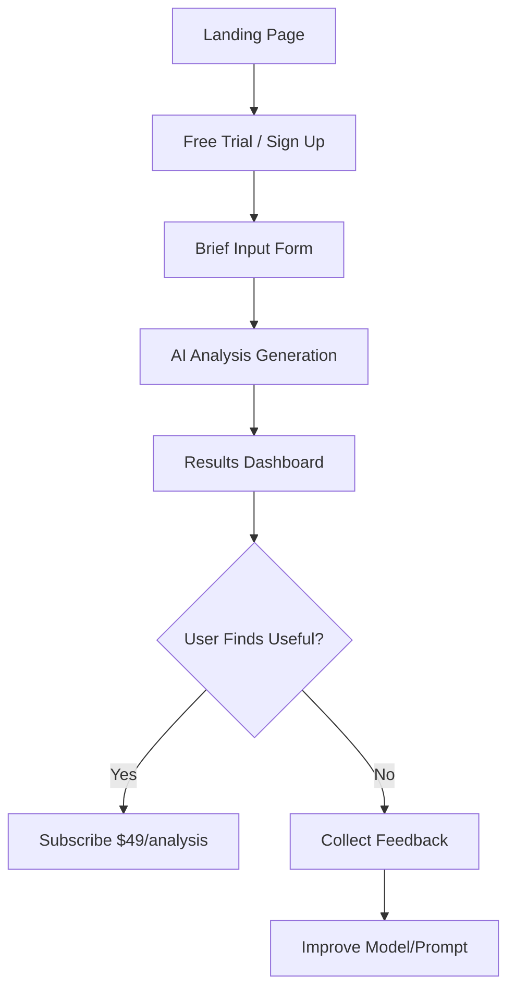

# Onboarding Flow (Based on User Research)

## Purpose
Design the user onboarding flow informed by user research findings.

## Proposed Flow

## Step Details

### 1. Landing Page
- **Disclaimer banner:** "Not legal advice. AI-generated decision support."
- **Value prop:** "Know your contract position in 30 seconds"
- **CTA:** "Try Free Analysis"

### 2. Brief Input Form
- Party name (optional)
- Contract type dropdown
- Dispute description (50-5000 words)
- Stakes amount
- Desired outcome
- **Disclaimer checkbox:** "I understand this is not legal advice"

### 3. AI Analysis Generation
- Loading state with estimated time
- Progress indicator
- Option to receive results via email

### 4. Results Dashboard
- Strengths/weaknesses breakdown
- Confidence score
- Argument analysis
- **Repeated disclaimer:** At top and bottom

### 5. Subscribe Flow
- $49 per analysis
- Option to save and compare multiple disputes
- Payment via Stripe

## User Research Inputs
*(To be filled after T0.3.1-T0.3.8)*

| Research Finding | Onboarding Impact |
|---|---|
| [e.g., users want free preview] | [e.g., add free sample analysis] |
| [e.g., users confused by AI output] | [e.g., add plain language explanations] |

## Human Action Required
- Refine flow based on user research responses (T0.3.15)
- Present to UX designer for frontend implementation
- Plan user interview schedule for beta testing (T0.3.16)
